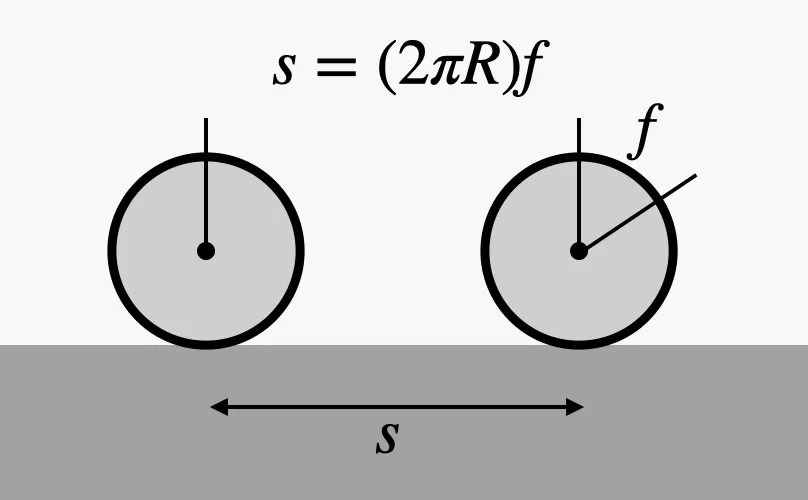
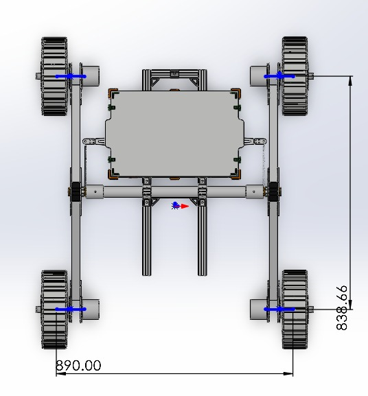
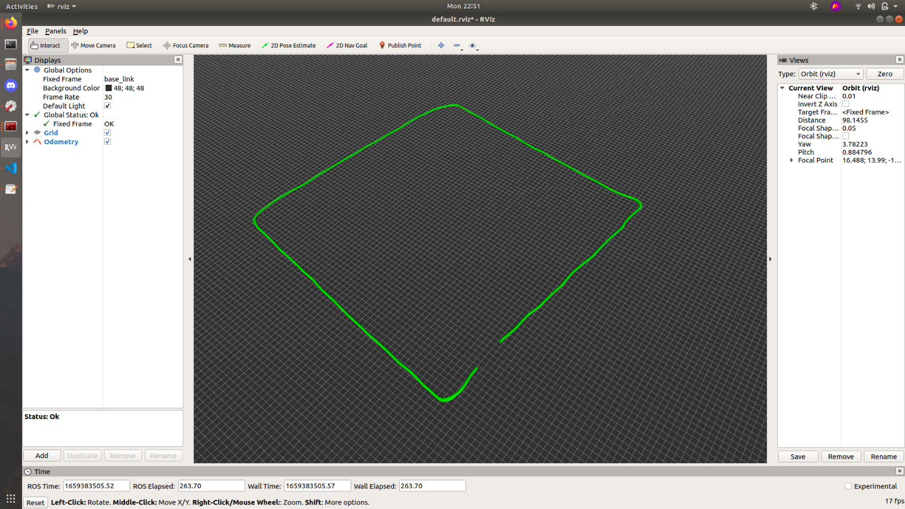

<div align="center">

</div>

# ITU Rover Odometry Assignment

Yukarıda gördüğünüz gezegen gezgini aracımızı Elektrik Elektronik Fakültesi'nde bir gezintiye çıkardık. Sizlere tahsis ettiğimiz **rosbag** dosyasında araç, gezintisini sürdürürken geri bildirim olarak aldığı teker hızı ve IMU verileri yer alıyor. Tekerleklerin yarıçapı ve hızları gibi bilgiler bilindiği için aracın başlangıç konumuna göre ne kadar ilerlediğini tahmin etmek mümkün.

<div align="center">

</div>


Ödevle ilgili daha fazla bilgiye ve yardımcı olacak kaynaklara aşağıdan ulaşabilirsiniz.

# Kurulum

Bir workspace oluşturun.

```
mkdir ~/rover_ws
cd ~/rover_ws
catkin_init_workspace
mkdir src
```

Bu paketi klonlayıp derleyin.

```
cd ~/rover_ws/src
git clone https://github.com/itu-rover/iturover_odometry_assignment
cd ..
catkin build
```

# Kullanım

Rosbag dosyasını çalıştırın.

`
roslaunch iturover_odometry_assignment rosbag.launch
`

Yukarıdaki komutu yazdıktan sonra gezintimiz sırasında araçta gerçekleşen veri transferlerinin aynıları bilgisayarınızda da gerçekleşecektir.

Aşağıdaki komut ile rosbag'in doğru bir şekilde çalışıp çalışmadığını anlayabilirsiniz.
`
rostopic echo /drive_system_left_motors_feedbacks
`

## Rosbag içeriği
Rosbag aşağıdaki topiclerden mesajlar içermektedir:

**/drive_system_left_motors_feedbacks**

Bu topicte 2 elemanlı bir [std_msgs/Float64MultiArray](http://docs.ros.org/en/lunar/api/std_msgs/html/msg/Float64MultiArray.html) türünde veri bulunmaktadır. 
array'deki elemenlar sırasıyla sol ön ve sol arka tekerleğin dakikadaki dönüş sayılarıdır.

`Örneğin; [30, 40] verisi sol ön tekerleğin 30 RPM, sol arka tekerleğin 40 RPM hızda döndüğünü gösterir.`

**/drive_system_right_motors_feedbacks** 

Bu topicte 2 elemanlı bir [std_msgs/Float64MultiArray](http://docs.ros.org/en/lunar/api/std_msgs/html/msg/Float64MultiArray.html) türünde veri bulunmaktadır. 
array'deki elemenlar sırasıyla sağ ön ve sağ arka tekerleğin dakikadaki dönüş sayılarıdır.

`
Örneğin; [30, 40] verisi sağ ön tekerleğin 30 RPM, sağ arka tekerleğin 40 RPM hızda döndüğünü gösterir.`

**/imu1/data**

Bu topicte aracın üzerindeki imudan gelen sensör verilerini bulabilirsiniz. Teker odometrisi için gerekli olmasa da dilerseniz bu veriyi de kullanabilirsiniz.

IMU verisindeki oryantasyon bilgisi quaternion olarak gelmektedir. (x,y,z,w) Oryantasyon bilgisini kullanabilmek için quaternion olan oryantasyon bilgisini euler (roll,pitch,yaw) şekline çevirmeniz gerekebilir. 

**Bknz.**
* http://wiki.ros.org/tf2/Tutorials/Quaternions
* tf2 kütüphanesinden euler_from_quaternion


# Gerekli bilgiler
Aşağıdaki ölçütlere ek olarak aracımızın teker yarıçapı 135mm'dir.


<div align="center">

</div>


# Ekran görüntüleri


Ödevi tamamladığınızda göreceğiniz görüntü aşağıdaki gibidir.

<div align="center">

</div>

# Ayrıca bakınız

* https://www.cs.columbia.edu/~allen/F17/NOTES/icckinematics.pdf
* https://www.cs.cmu.edu/~16311/s07/labs/NXTLabs/Lab%203.html
* https://www.youtube.com/watch?v=aE7RQNhwnPQ
* https://www.youtube.com/watch?v=XbXhA4k7Ur8
